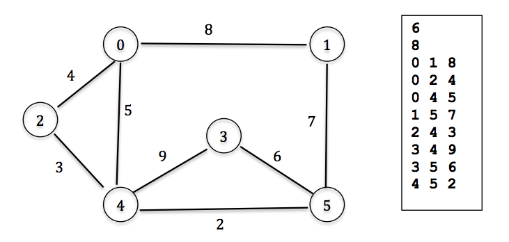

Assignment 4
====

Graphs can be used to model a lot of real-life situations, including computer networks. Large computer networks contain many nodes and can become disconnected if some nodes within the network fail. In this assignment you will use a graph to represent a simple computer network, and you will use some graph algorithms to determine the current status of the network. As nodes fail you will remove them from the network, and as they are repaired you will return them to the network. Edges may also change as the quality of various connections changes over time. As the network changes you will report its status, specifically each of the following:

1. Whether or not the network is currently connected
2. Which edges are currently up or down in the network.
3. A listing of the current subnetworks and their vertices and edges (i.e. the connected components within the network)
4. A minimum spanning tree for the network
5. The shortest path from arbitrary vertex i to arbitrary vertex j.
6. Whether or not the network, in its present state, has an Eulerian tour or an Eulerian path or none of these. 

An Eulerian tour is a listing of vertices v1, v2, ..., vk, v1 (repeats allowed) such that every edge in the network is visited once and only once (i.e., { (v1,v2), (v2,v3), ..., (vk,v1) }  is the set of all edges in the network. An Eulerian path is a listing of vertices v1, v2, ..., vk (repeats allowed) such that every edge in the network is visited once and only once (i.e., { (v1,v2), (v2,v3), ..., (vk-1,vk) }   is the set of all edges in the network. A  graph possesses an Eulerian tour if and only if every vertex has even degree. A graph possesses an Eulerian path if and only if exactly two vertices are of odd degree. The graph shown below has exactly two vertices of odd degree (vertices 0 and 5 have degree 3, all other vertices are of even degree), so this graph possesses an Eulerian path: 0 - 2 - 4 - 0 - 1 - 5 - 3 - 4 - 5. Note every edge is visited once and only once!

##Details:
Initially you will read in a graph from a file, formatted in the way indicated in your textbook. The first line will contain an integer representing V, the number of vertices in the graph. The second line will contain an integer representing E, the number of edges in the graph. The remaining E lines will contain triples to represent the actual edges in the graph. The first two values in the triple will be the two vertices that terminate the edge and the third value will be the weight of the edge. All edges will be bidirectional, so if edge (a, b) has weight w, then edge (b, a) also has weight w. For example, the simple graph shown below will be represented by the file shown in the box immediately to the right of it.

 
Updates to the graph and the report options will be obtained via interactive user input. Below are a list of the commands and the expected results:
- `R (eport)` – display the current active network (all active nodes and edges, including edge weights); show the status of the network (connected or not); show the connected components of the network
- `M (inimum spanning tree)` – show the vertices and edges (with weights) in the current minimum spanning tree of the network
- `S i j` – display the shortest path (by latency) from vertex i to vertex j in the graph 
- `D i j` – edge (i,j,w) in the graph will go down.
- `U i j` – edge (i,j,w) in the graph will come back up.
- `C i j x` –change the weight ofedge(i,j) (and of edge(j,i)) in the graph to value x. If x is <= 0 the edge(s) should be removed from the graph. If x > 0 and edge (i, j) previously did not exist, create it
- `E (ulerian)` - does the graph possess an Eulerian tour or Eulerian path or neither? If such a tour or a path exists, display it.
- `Q` – quit the program

##Implementation:
You are required to use an adjacency list to represent your graph, and you may use any of the textbook author's files as a starting point. Here are a few important implementation requirements and issues that are worth noting: 

- The graph file name should be entered as a command line argument
- The author's implementations do not take into account removal of vertices or edges. You will need to adapt the implementations to handle this ability. There are various ways of doing this but note that when you restore a vertex its edges are also restored, so you need to store the edge information even when a vertex is down.
- The author uses different classes for the minimum spanning tree (EdgeWeightedGraph) and the shortest path tree (EdgeWeightedDigraph). As we discussed in lecture, we can easily make a directed graph with bidirectional links by simply adding an edge in each direction (a, b) and (b, a) for each bidirectional edge (a, b). Take this into account when building your graph, since the file format includes only one vertex pair for each edge.
- The shortest path code provided by the author gives the shortest path from the source to each of the other vertices in the graph. Clearly, you should not display all of these, so you should modify this code.

I may post some sample output, and will likely post at least one additional graph file. Check back and be sure to test your program on all of the sample files.

Thanks Dr. Ramirez for your suggestion!

```
Rubric:
-------------------------------------
R(eport)                | 15 points |
-------------------------------------
M(inimum spanning tree) | 15 points |
-------------------------------------
S i j                   | 15 points |
-------------------------------------
D i j                   | 10 points |
-------------------------------------
U i j                   | 10 points |
-------------------------------------
C i j x                 | 15 points |
-------------------------------------
E                       | 20 points |
-------------------------------------
```
